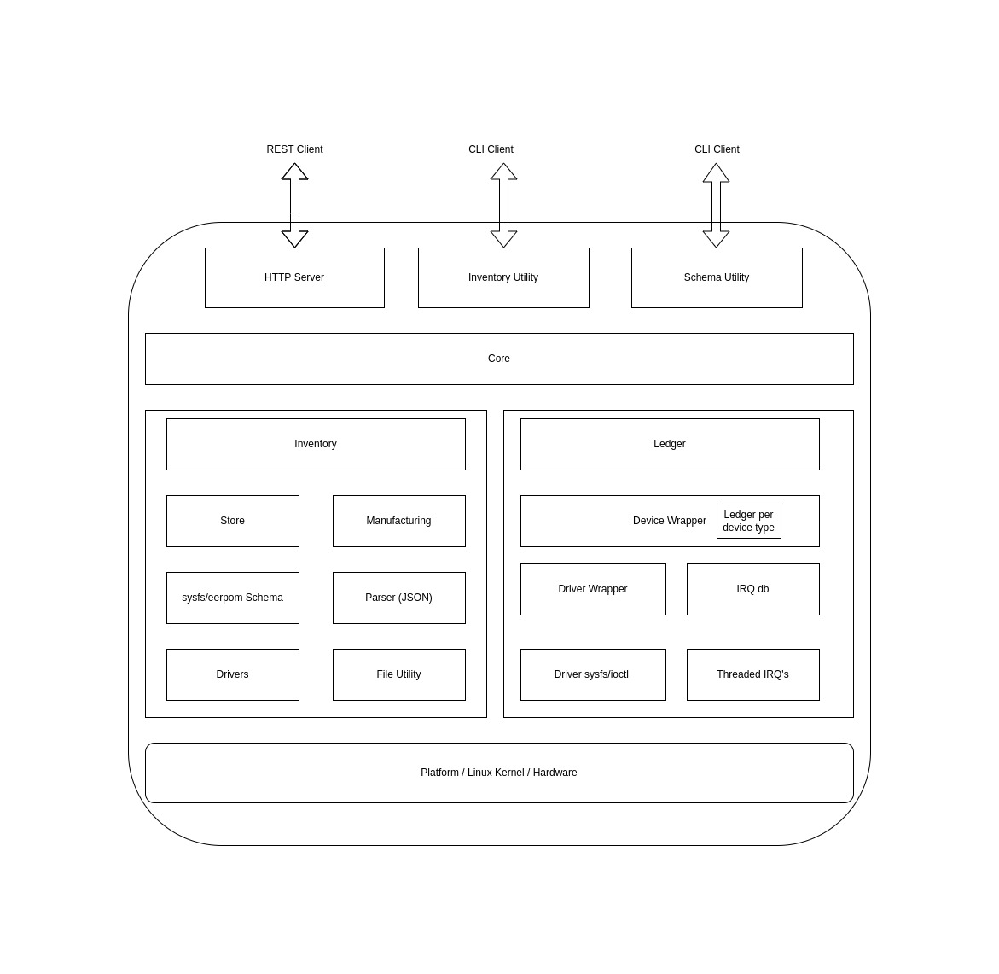

# NodeD Service

NodeD service is to manage and support HW devices.

## Architecture Diagram
NodeD is divided into few logical blocks based on thier operations.
* Inventory

> Handles the manufacturing data related operations like creating invenrory database for modules, storing and retriving data from inventory database.<br>
Data stored in inventory data base is description of the hardware it's present on listingout sensors available of module,
it's manufacturing dates etc. Apart from Harware information it also stores configurations and certficates used by software to perform day to day operations.


* Ledger

> Handles sensor configurations such as updating behavior, reading status, enabling alerts, disabling alerts etc.

* Comm

> Provide a REST API based inetrface for other application to access and update harware status and certificates



## Building
Preferred build method is to use UkamaOS build.

```
make
```

## Testing

#### Preparing setup

**Mocking SysFileSystem**

For testing purpose we can mock our sysfs under /tmp/sys directory using prepare_env.sh script

Example:

```
./utils/prepare_env.sh -u tnode -u anode
```

**Generate Schema**

Dummy schema are provided under mfgdata/schema folder. Modification can be made to it on need basis.
If we just need to replicate these with updated serial numbers we could use ustility like genSchema.

Example:

```
./build/genSchema --u UK-7001-HNODE-SA03-1103 --n com --m UK-7001-COM-1103  --f mfgdata/schema/com.json --n trx --m UK-7001-LTE-1103  --f mfgdata/schema/trx.json --n mask --m UK-7001-MSK-1103 --f mfgdata/schema/mask.json
```

Could use this for more information

```
./build/genSchema --help
```

**Generate Inventory Database**

This utilty creates a inventory database for the modules you supplies as an argument to the utilty and place those under /tmp/sys directory

Example:

```
./build/genInventory --n com --m UK-8001-COM-1102 --s mfgdata/schema/com.json -n trx --m UK-8001-LTE-1102 --s mfgdata/schema/trx.json --n mask -m UK-8001-MASK-1102 --s mfgdata/schema/mask.json
```

Again this could be used for more information

```
./build/genInventory --help
```

#### Run NodeD service

You can run noded service with deafult arguments but if wishes to change ineventory database or sensor related attributes
those can be provided in config files and supplied as argument to noded.

```
./build/noded
```

#### Availible REST API's

Some of the API listed below requires paramters to be passed. Look at [examples](#Examples) for more details.

```
curl -X GET "http://localhost:8085/noded/v1/discover" | jq
```

**Output**

```
% Total    % Received % Xferd  Average Speed   Time    Time     Time  Current
                                 Dload  Upload   Total   Spent    Left  Speed
100   501  100   501    0     0   489k      0 --:--:-- --:--:-- --:--:--  489k
{
  "api": [
    {
      "method": "GET",
      "endPoint": "/noded/v1/ping"
    },
    {
      "method": "GET",
      "endPoint": "/noded/v1/unitinfo"
    },
    {
      "method": "GET",
      "endPoint": "/noded/v1/unitconfig"
    },
    {
      "method": "GET",
      "endPoint": "/noded/v1/moduleinfo"
    },
    {
      "method": "GET",
      "endPoint": "/noded/v1/moduleconfig"
    },
    {
      "method": "PUT",
      "endPoint": "/noded/v1/deviceconfig"
    },
    {
      "method": "GET",
      "endPoint": "/noded/v1/deviceconfig"
    },
    {
      "method": "GET",
      "endPoint": "/noded/v1/mfg"
    },
    {
      "method": "PUT",
      "endPoint": "/noded/v1/mfg"
    },
    {
      "method": "GET",
      "endPoint": "/noded/v1/discover"
    }
  ]
}
```

#### Examples

```
Unit Info: curl --request GET   --url http://localhost:8085/noded/v1/unitinfo | jq
Unit Config: curl --request GET   --url http://localhost:8085/noded/v1/unitconfig | jq
Module Info: curl --request GET   --url 'http://localhost:8085/noded/v1/moduleinfo?uuid=UK-8001-LTE-1102' | jq
Module Config: curl --request GET   --url 'http://localhost:8085/noded/v1/moduleconfig?uuid=UK-8001-LTE-1102' | jq

Sensor Device Config:
Read Config: curl --request GET   --url 'http://localhost:8085/noded/v1/deviceconfig?uuid=UK-8001-COM-1102&type=1&name=TMP464&desc=PMIC&prop=T1%20HIGH%20LIMIT' | jq
Write Config: curl --request PUT   --url 'http://localhost:8085/noded/v1/deviceconfig?uuid=UK-8001-COM-1102&type=1&name=TMP464&desc=PMIC&prop=T1%20HIGH%20LIMIT'   --header 'content-type: application/json'   --data '{"name": "TMP464", "description": "PMIC", "dataType": 11, "value": 65000}'

Factory Config
Read Factory Config: curl --request GET   --url 'http://localhost:8085/noded/v1/mfg?uuid=UK-8001-COM-1102&name=factoryconfig'
Write Factory Config: curl --request PUT  --header "Content-Type:application/octet-stream" --url 'http://localhost:8085/noded/v1/mfg?uuid=UK-8001-COM-1102&name=factoryconfig' --data-binary @test

UserConfig
Read User Config: curl --request GET   --url 'http://localhost:8085/noded/v1/mfg?uuid=UK-8001-COM-1102&name=userconfig'
Write User Config: curl --request PUT  --header "Content-Type:application/octet-stream" --url 'http://localhost:8085/noded/v1/mfg?uuid=UK-8001-COM-1102&name=userconfig' --data-binary @test

Factory Calibration
Read Factory Calibration: curl --request GET   --url 'http://localhost:8085/noded/v1/mfg?uuid=UK-8001-COM-1102&name=factorycalibration'
Write Factory Calibration: curl --request PUT  --header "Content-Type:application/octet-stream" --url 'http://localhost:8085/noded/v1/mfg?uuid=UK-8001-COM-1102&name=factorycalibration' --data-binary @test

User Calibration
Read User Calibration: curl --request GET   --url 'http://localhost:8085/noded/v1/mfg?uuid=UK-8001-COM-1102&name=usercalibration'
Write User Calibration: curl --request PUT  --header "Content-Type:application/octet-stream" --url 'http://localhost:8085/noded/v1/mfg?uuid=UK-8001-COM-1102&name=usercalibration' --data-binary @test

Bootstrap Certs:
Read Bootstrap certs: curl --request GET   --url 'http://localhost:8085/noded/v1/mfg?uuid=UK-8001-COM-1102&name=bootstrapcerts'
Write Bootstrap certs: curl --request PUT  --header "Content-Type:application/octet-stream" --url 'http://localhost:8085/noded/v1/mfg?uuid=UK-8001-COM-1102&name=bootstrapcerts' --data-binary @testT1%20HIGH%20LIMIT

Cloud certs:
Read Cloud certs: curl --request GET   --url 'http://localhost:8085/noded/v1/mfg?uuid=UK-8001-COM-1102&name=cloudcerts'
Write Cloud certs: curl --request PUT  --header "Content-Type:application/octet-stream" --url 'http://localhost:8085/noded/v1/mfg?uuid=UK-8001-COM-1102&name=cloudcerts' --data-binary @test

```
