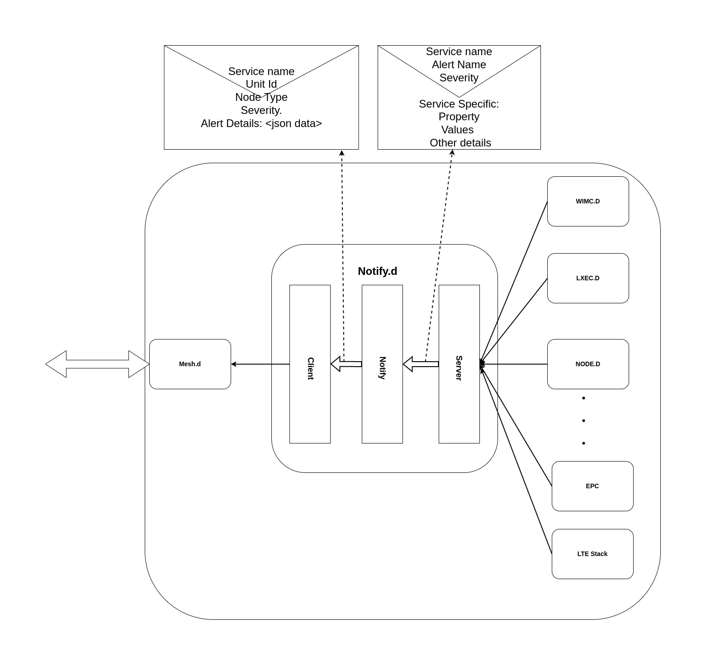

# Notifyd [WIP]

Notification service running on the ukama node to report alarm and notification to consile apps.

## Architecture Diagram

Notifyd consist of a rest based client and server. Server for recieving events from the services and client to report these events to cloud servcie using meshd. Notifyd enacapsulate the event recived from the services and add information regarding nodes the event for easily identifying the node on cloud.





## Build
```
make
```

## Test

