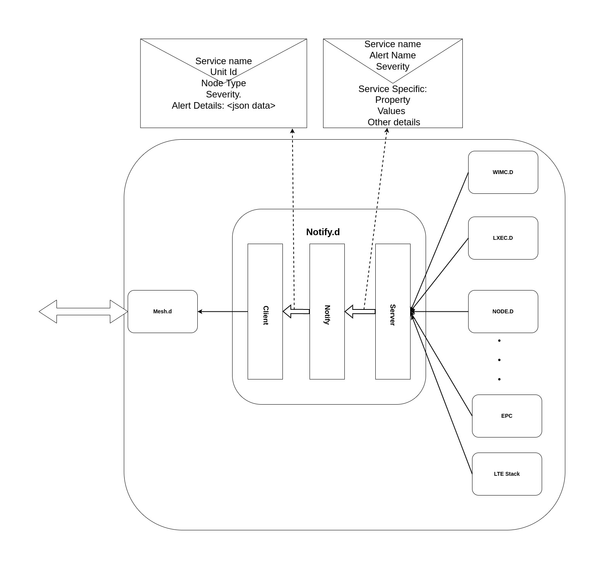

# Notifyd [WIP]

Notification service running on a Ukama node. It receives local events and
alerts, enriches them with node information, and forwards them to the configured
destination.

## Architecture Diagram

Notifyd provides a REST server for local services and a client for forwarding
notifications to the Ukama system.



## Build

```sh
make
```

## API

```text
POST /v1/event/:service
POST /v1/alert/:service
```

The service in the URL and `service_name` in the JSON body must identify the
same sending service.

## Post a deviced event

```sh
curl --request POST \
  --url http://localhost:18010/v1/event/deviced \
  --header 'Content-Type: application/json' \
  --data '{
    "service_name": "deviced",
    "severity": "high",
    "time": 1784404497,
    "module": "none",
    "name": "node",
    "value": "reboot",
    "units": "",
    "details": "Rebooting the node"
  }'
```

## Post a deviced alert

```sh
curl --request POST \
  --url http://localhost:18010/v1/alert/deviced \
  --header 'Content-Type: application/json' \
  --data '{
    "service_name": "deviced",
    "severity": "high",
    "time": 1784404497,
    "module": "none",
    "name": "node",
    "value": "fault",
    "units": "",
    "details": "Device action failed"
  }'
```
