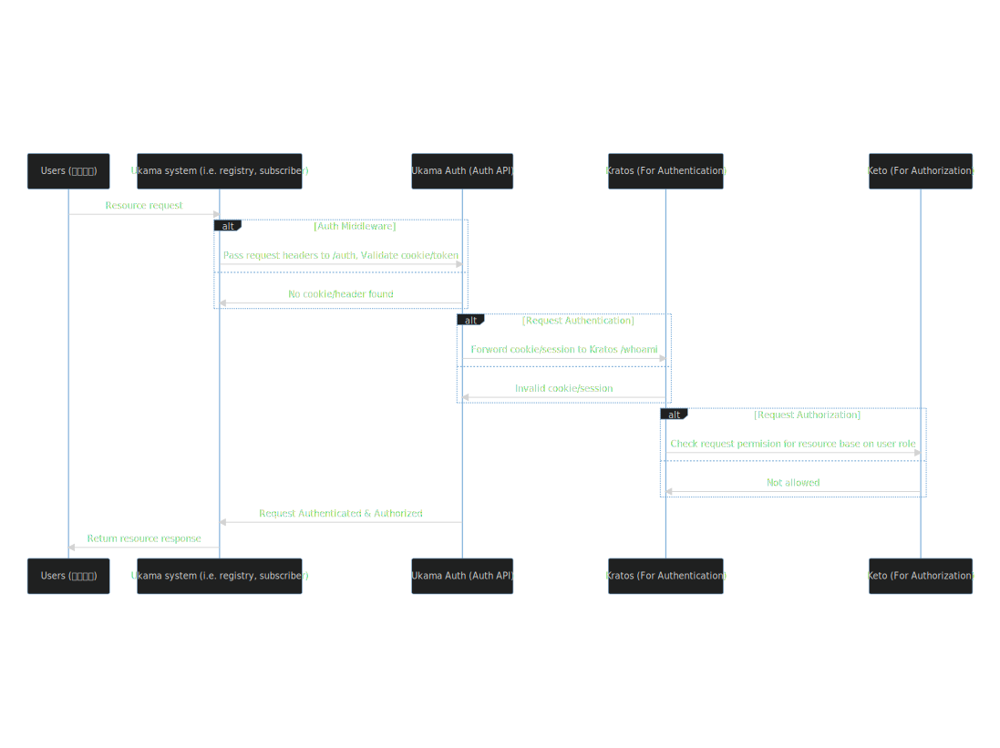

# AUTH SYSTEM

Auth system is responsible of `authenticate` & `authorize` all incoming request. Ukama auth system is build with Ory Kratos identity management and Ory Keto access control.

For Authentication incoming request should include either valid `ukama_session` cookie Or `X-Session-Token` headers.

`ukama_session` cookie is mainly for browser base requests. To get the cookies in your browser you just need to login on [Ukama Auth](https://auth.dev.ukama.com), On successful login cookies will be set on you browser.

Non-browser clients one can use login api from auth system which will provide token.

For Authorization request should include user `role`, `namespace` and `subject_id`.